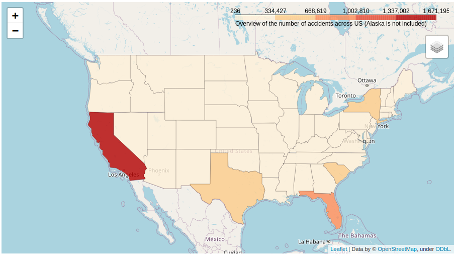
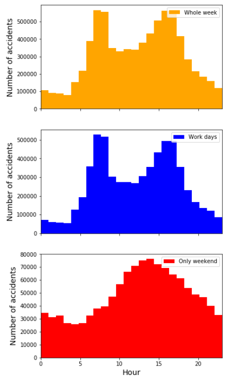
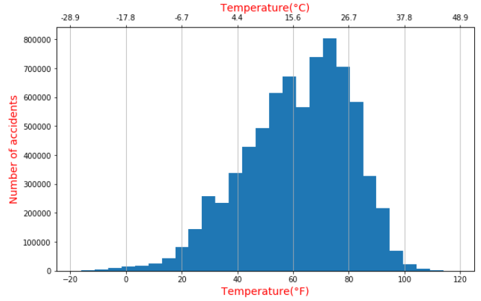

<!-- Give a title to this file. -->
<h1 style="text-align: center;"> USA traffice accidents data analysis and data vsualization</h1>
<!-- Insert a topic/ project related illustrative image.-->

    

<!-- Image source: https://www.meine-news.de/hoepfingen/c-blaulicht/hoepfingen-8000-euro-schaden-nach-kollision_a25765, of a post with title: Höpfingen: 8.000 Euro Schaden nach Kollision. -->

<!-- Table of Contents -->
**Table of Contents**

* <a href="#ref0">About this Project</a>
* <a href="#ref1">Technical features</a>
* <a href="#ref2">Usage Policy and Legal Disclaimer about the used dataset</a>
* <a href="#eg">Few example plots</a>
* <a href="#ref3">References

 
<!-- Horizontal line -->

**<a id="ref0">About this Project</a>** 

This is a simple data analysis and data visulization project. The dataset used in this project was provided in Kaggle's Data category in this link:  **https://www.kaggle.com/sobhanmoosavi/us-accidents** or directly accessible at the personal site of provider _Sobhan Moosavi_ in this link:  **https://smoosavi.org/datasets/us_accidents**. The dataset covers all recorded traffic accidents occured in 49 states of the United States from February 2016 to June 2020. 

**<a id="ref1">Technical features</a>**

* There are more than **3.5 million** accidents are recorded.
* Used tools and libraries:

*	 
    
**<a id="ref2">Usage Policy and Legal Disclaimer about the used dataset</a>**

The original provider of the dataset used in this project has also added the following **Usage Policy and Legal Disclaimer**:

>_This dataset is being distributed only for Research purposes, under Creative Commons Attribution-Noncommercial-ShareAlike license (CC BY-NC-SA 4.0). By clicking on download button(s) below, you are agreeing to use this data only for non-commercial, research, or academic applications. You may need to cite the above papers if you use this dataset._

As we all knew that collecting such a large amount of usefull dataset is not an easy task. Therefore as the author of this project, I sincerely ask those who are planning to use this dataset to respect the work of the original provider and abovementioned license.

** <a id="eg">Few example plots</a>**
* Distribution os the accidents
	
 
 
* Hourly distribution
	
* Distribution by temperature
	

**<a id="ref3">References</a>**
	
[1]. <a href="https://www.kaggle.com/sobhanmoosavi/us-accidents">  www.kaggle.com/sobhanmoosavi/us-accidents</a>  
[2]. <a href="https://arxiv.org/abs/1906.05409">arXiv:1906.05409</a>  
[3]. <a href="https://arxiv.org/abs/1909.09638">arXiv:1909.09638</a>

